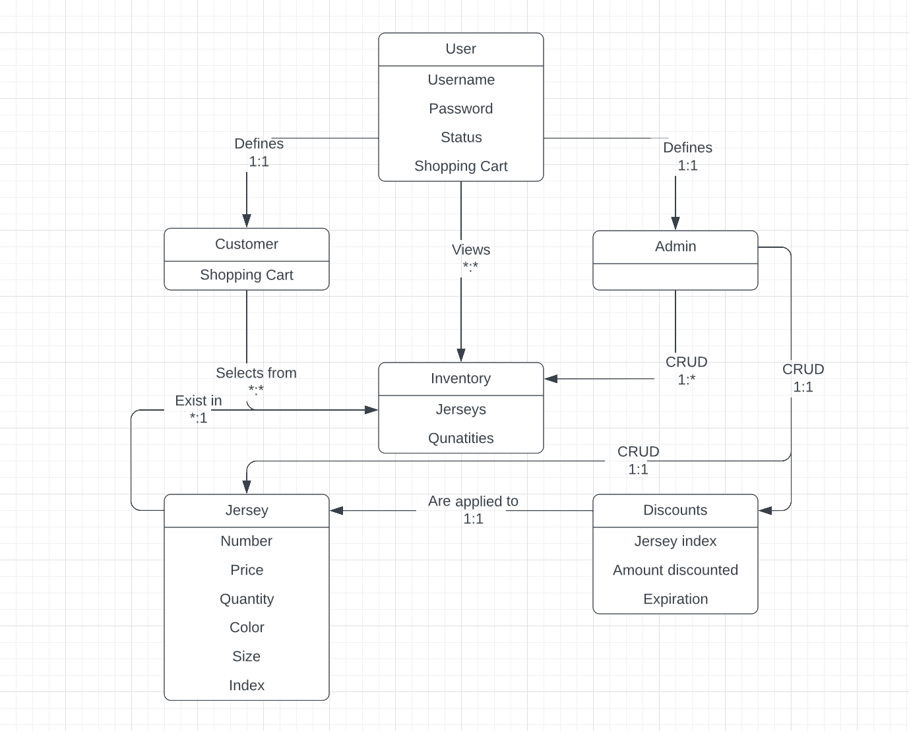
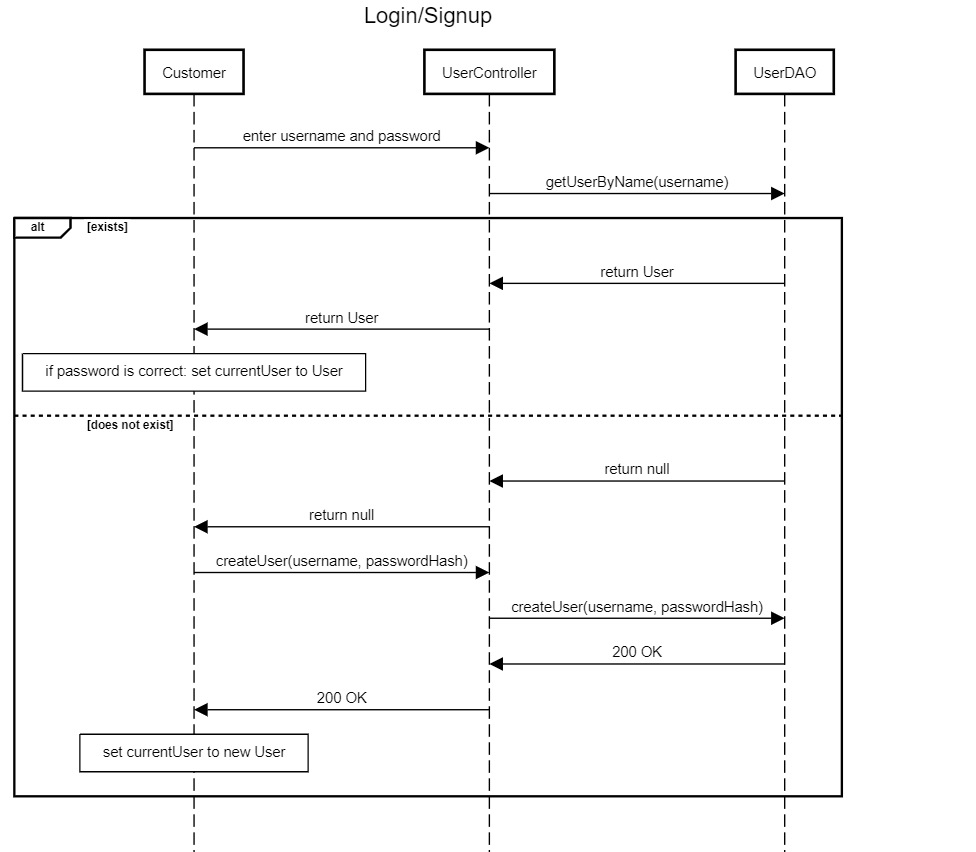
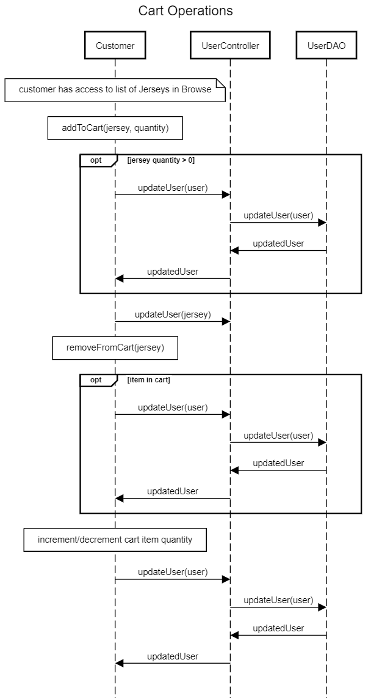
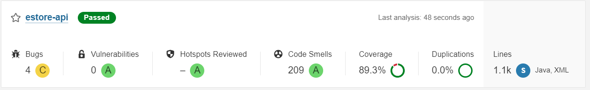
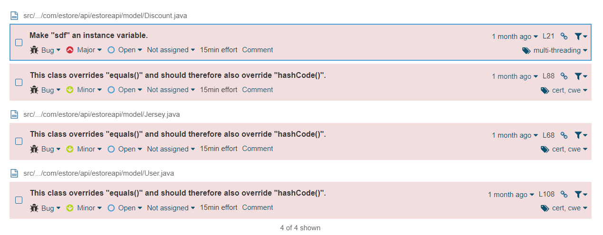
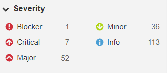
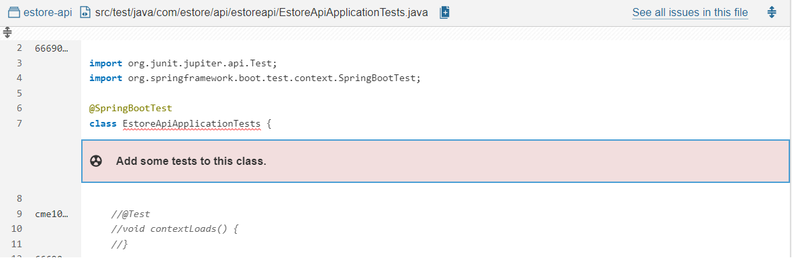
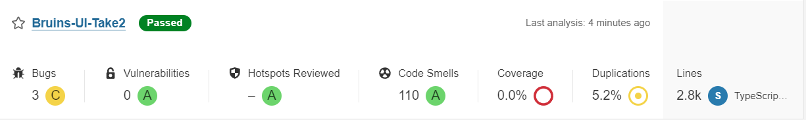
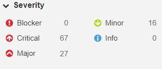

# NHL Jersey E-Commerce Site Design Documentation

## Team Information
* Team name: Bruins
* Team members
  * Coray Bennett
  * Chase Elliott
  * Sam Lloyd
  * Joe Baillie

## Executive Summary
We are creating a website that will be accessible to users. These users will
be able to log in with a username, view items, sort the items by filters, 
and search for specific items. The ADMIN will have the ability to add discounts,
edit the inventory by adding and removing items, and changing data about individual
items.

### Purpose
The project is meant to sell jerseys in an ordered manner. The two
most important users will be the customer and the admin. The customer
is responsible for accessing the items and their individual shopping cart,
while the admin is responsible for inventory management. 

### Glossary and Acronyms
> _Provide a table of terms and acronyms._

| Term | Definition |
|------|------------|
| SPA | Single Page |
| hash | a code that is generated based on some text, which is impossible to reverse (cannot find the text from the hash). |
| fast-sha256 | library that allows password hashing using the sha256 (secure hashing algorithm 256bit) algorithm |
| identifier | property of an object that defines its 'uniqueness' (what you use to get the object from the database) |

## Requirements

### Definition of MVP
  A Jersey estore that lets users browse, search, add to cart, and check out to purchase jerseys, and lets admins manage inventory in the estore.

### MVP Features
  -Minimal Authentication for customer/admin: login with username, "admin" will be considered admin, any other username will be considered customer

  -Customer functionality: browse, search, add to cart, remove from cart, check out

  -Admin functionality (Inventory Management): add to inventory, remove from inventory, edit products in inventory

  -Data Persistence: Customer carts are maintained after logout

### Roadmap of Enhancements
  -Password authentication for login: add a password field to login in order to authenticate the admin/user accounts (IMPLEMENTED)

  > Note: Password feature adds additional dependencies of fast-sha256 and base64-arraybuffer for encryption

  -Jersey discounts: allow admin to create discounts with expiration dates, discounts apply to single jersey items (IMPLEMENTED)

  -Jersey images: add images to Jerseys in order for the customer to see what they are purchasing

  -Database implementation: improve backend services by implementing a backend into our persistency

## Application Domain

This section describes the application domain.

### Main Entities:

#### User: 
  logs in with username and password
  - Admin: inherits login from user entity
  - Customer: inherits login from user entity

#### Shopping Cart: 
  - 1:1 user relationship
  - each user contains a shopping cart

#### Jerseys: 
  - Exist within Inventory
  - accessed, purchased by customers

#### Inventory: 
  - Holds jerseys
  - can be viewed by customers
  - edited by admin

#### Discounts: 
  - get applied to jerseys on a 1:1 basis
  - related by jersey ID

### Relationships:

User:
- the parent class of admin and customer
- can view the inventory

USER RELATIONSHIPS ARE INHERITED BY ADMINS AND CUSTOMERS

Admin:
- can manage inventory by changing attributes of the jerseys in inventory
- can create and delete jerseys

Customer:
- can view their shopping cart
- can edit their personal shopping cart by adding and removing Jersey objects present in their shopping cart

Shopping Cart:
- exists for every customer
- contain pairs of jersey indices and quantities

Jersey:
- can be added to shopping carts by customers
- can be edited by admins
- can have discounts applied to them

Inventory:
- can be viewed and searched by users
- can be edited by Admins
- is comprised of Jerseys

Discount:
- share indeces to Jerseys on a 1:1 basis
- displayed as a Jersey price by calculating the final price

## Architecture and Design

This section describes the application architecture.

### Summary

The following Tiers/Layers model shows a high-level view of the webapp's architecture.

The e-store web application, is built using the Model–View–ViewModel (MVVM) architecture pattern. 

The Model stores the application data objects including any functionality to provide persistance. 

The View is the client-side SPA built with Angular utilizing HTML, CSS and TypeScript. The ViewModel provides RESTful APIs to the client (View) as well as any logic required to manipulate the data objects from the Model.

Both the ViewModel and Model are built using Java and Spring Framework. Details of the components within these tiers are supplied below.

### Overview of User Interface
<!-- > Currently the user interface enters into the admin view. In this
> view their are five tabs at the top that allow an admin to view, create, modify and delete jerseys
> and discounts. The UI also currently displays the name of the store and a message
> section at the bottom that displays the return values from commands. The five buttons
> at the top of the page that an admin currently has access to is Jersey list, Create Jersey, Delete Jersey,
> Search Jerseys, and Create Discount. Along with this, when a jersey is clicked on, the admin is brought to
> a page where they can update the information of the jersey. From this page, you can return to the list of 
> jerseys by hitting the back button. For the next sprint, we plan to add 
> better and more consistent formatting to make the website easier to follow, as well
> as a seperate customer oriented view. from sprint 2 -->

The first thing a user sees when opening the website is the login page. This will allow a user to create an account, or log in
to their current account. This requires a password, which will be registered the first time the user logs in. 

The user sees 3 naviagtion buttons after logging in: Browse, Cart, and Logout. 

The Browse page contains search, sort, and add to cart functionality for users. 

The Cart page contains the users current cart, and allows changes in quantity, item removal, and checkout.

The Logout button will sign the user out and return to the login page.

When logging in as admin, the navigation buttons are Browse, Add Jersey, and Logout.

The admin Browse page still allows search and sort, but also allows updating and deleting jerseys/discounts on those jerseys.

The admin Add Jersey page allows an admin to create new Jersey objects to be added to the store.

##### Styling Documentation
Color palette: 
- Bruins Yellow
- Black
- Light Yellow
- Light Blue
- Blue
- Dark Blue
- Secondary Blue
- Dark Red
- Green
- White 
- Gray

Different colors serve different purposes, Bruins Yellow and Black are used as primary theming colors.

Blues are used as background or confirmation colors, secondary blue specifically for hovering buttons.

Dark red is used for input fields and delete/undo/cancel buttons.

White, Gray, Black used as different background/border/font colors.

##### Website structure:
Main website content is in a gray container, with dark blue background surrounding it (can be changed to fit team colors).
Navigation buttons located at top of page, flex to window size.

Home/Browse page for both users and admins is the jersey navigation page, where you can search or sort jerseys by certain attributes.
Users have a cart page that lists their current jerseys in cart and total price.
Users can remove items from their cart entirely, or increase/decrease the quantity of each item.
Admins have an add jersey page that allows them to create completely new jerseys on the store.
Admins can also update each jersey in the store, as well as its discount, on the update jersey page.

Each jersey is contained in a separate component that lists all of its information, as well as an Update and Delete button for admin,
and an Add to Cart button for customers. The jersey that is displayed is passed through a component parameter using Input.

The Update page contains fields for each attribue of the jersey, as well as the jersey's discount. If the jersey you are accessing
does not have a discount, a "create discount" option is displayed instead.
A "delete" button is present for the existing discounts; when clicked, a second confirmation button will appear in order to prevent accidental deletions.

### View Tier

#### Login:
  The home page of the website displays a login component with fields for username and password.
  - When a user inputs a new username, a new user is created and the current user for that instance is updated. The password entered is also used, but is hashed for security.
  - When a user inputs a returning username, the password entered is verified based on that users password hash. 
    If and only if the correct password is entered will the current user be updated.
  
  The sequence diagram for Login can be seen here:  
  

#### Browse:
  After logging in, the user is redirected to the browse page. The browse page has the following functionality:
  - Users can scroll through the full list of jerseys
  - Users can search for jerseys by name, color, size, or number
  - Users can sort jerseys by price (high-low or low-high) and by name (A-Z and Z-A)
  **Customer**
  - Customers can add some quantity of jersey to their cart
  **Admin**
  - Admins can access the update page for a jersey from browse
  - Admins can delete a jersey from browse

#### View Jersey: 
  The Browse page is populated with "jersey view" components. Each of these components packages the Jersey and Discount objects together to be rendered.
  - Displays all properties of a jersey (name, number, price, color, size, quantity)
  - Displays the final price of a jersey after a discount is applied

  **Customer**
  - Contains the "add to cart" button and "quantity" selector

  **Admin**
  - Contains the "update" link and "delete" button

#### Update Jersey:
  Only the admin account has access to the update jersey page. It has the following functionality:
  - Update each property of a jersey (name, number, price, color, size, quantity)
  - Create discount if one does not exist for that jersey
  - Update each property of a discount (percentage, expiration date)
  - Delete a discount from the jersey

#### Add Jersey:
  Only the admin account has access to the add jersey page. It has the following functionality:
  - Fill in each property of a jersey (name, number, price, color, size, quantity)
  - create new jersey object in database/file system

#### Cart:
  Only customers (non-admins) have access to the cart page. It has the following functionality:
  - Customers can view their current cart items/quantities.
  - Customers can remove jerseys from their cart.
  - Customers can increment and decrement quantities of jerseys in their cart
  - Customers can move to the checkout page

  The sequence diagram for the Cart can be seen here:

  

#### Checkout:
  Once customers navigate to the checkout page, they are prompted for ordering information. This information is not actually stored, as no real orders are received.
  Checkout proceeds once valid info is entered, and the store inventory is properly updated to reflect the quantities purchased.

<!-- > 
from sprint 2:
When an admin first enters the website, the app component displays five buttons that can direct
> the admin to list, create, delete, and search for jerseys, as well as create discounts. When the first button is clicked
> the user is routed via the estoreRouting module to the jerseysList component. This component
> displays a list of all the information of each jersey curently in the inventory. It is able to access the
> inventory through the jersey service which return an observable object of type jersey array to the
> component.ts file, which then converts it to jersey objects and displays their information for the user.
> If the were to then click on a specific jersey, they would be routed to the update-jersey component.
> This component displays all the information associated with a specific jersey in text boxes where it can
> be edited. Once the editing is complete, The admin can press the save button to change the information of the jersey. 
> Then the admin can press the back button to return to the list of jerseys and see the newly changed information. 
> Next, the admin could click the second button at the top to create a jersey. This will bring the admin to a screen very 
> similar to the update jersey screen. The admin can now enter new information into each text box, which is checked for invalid
> input, then click create at the bottom of the screen to create a new jersey. Then the admin could click the third button
> and move to the delete jersey screen. Here, the index of a jersey can be entered into a text box and then deleted from the inventory
> The fourth button is used to search for specific jerseys. Here the admin could search for any small jersey or any jersey with a 5 in its number. 
> Then with that information, they could click the fifth button and move the discount creation screen. Here the admin
> could assign discounts with a percentage off to a specfic jersey and give it an expiration date. While the admin does
> this, they will also be recieving updates from the message service at the bottom of the page to inform them of if
> their commands and actions were successful. 

> _You must also provide sequence diagrams as is relevant to a particular aspects 
> of the design that you are describing.  For example, in e-store you might create a 
> sequence diagram of a customer searching for an item and adding to their cart. 
> Be sure to include an relevant HTTP reuqests from the client-side to the server-side 
> to help illustrate the end-to-end flow._ -->

### ViewModel Tier
 Our view model allows the access and control of objects using a RESTful API Controller with CRUD commands. We have controllers for the following objects:
  - Jerseys
  - Discounts
  - Users
  
  These inventories are stored in JSON files on our backend server, and are accessed and updated depending on the requests sent by an admin.
  
  - When a READ request is sent, a list of all objects is received. Using this information, all references of each object are available.
  - When an UPDATE request with a JSON object in the body is sent, the object in the model will be updated so long as the info in the request is valid.
  - When a CREATE request with a JSON object in the body is sent, a new object will be added to the inventory if it is valid and does not conflict with existing objects.
  - When a DELETE request with an index is sent, the object related with that index is removed from the inventory if the object exists.

  **Jerseys**
  - You can send a READ request with a selected key for Jerseys (Search), which may match certain Jerseys and will return a list of only Jerseys that match the key.
  
  **Users**
  - You can send a READ request with a specific name for Users (get User by name), which will find a user if and only if it matches that name exactly.

### Model Tier
  Our model tier describes the following objects: 
  - Jerseys
  - Discounts
  - Users

  #### Jersey:
    Jersey has the following properties:
      - index : Integer (identifier)
      - name : String
      - number : Integer
      - color : String
      - size : String
      - price : Double
      - quantity : Integer
    A Jersey's index is guaranteed to be unique due to how they are created in the ViewModel tier.
    If all of a jersey's properties are identical to another, there will be a conflict and the Jersey will not be created.

  #### Discount:
    Discount has the following properties:
      - index : Integer (identifier)
      - percentage : Float
      - expiration : String
      - expirationCalendar : Calendar (ignored by JSON)
    A Discount's index is directly related to a Jersey index (Discount with same index as Jersey is applied to that Jersey).
    The expirationCalendar property only exists on the backend server, and is used to easily test whether the discount is expired.

  #### User: 
    User has the following properties:
      - index : Integer (identifier)
      - name : String (also kind of an identifier)
      - status : boolean
      - cart : Integer[][]
      - passwordHash : String
    A User's index is unique, and not related to Jersey/Discount. The name is also used to identify a user when logging in.
    The status variable is for admin status, which allows for an implementation that gives multiple accounts admin access.

    The cart contains multiple Integer arrays, which each represent a key:value pair of a Jersey index and a quantity value.

    The passwordHash is an encrypted value that is checked against passwords entered while logging in as that user.

### Static Code Analysis/Design Improvements

##### Back-End Improvements
Now that our MVP including our ten percent feature is finished, the design improvements we could implement have become more clear.
As it stands, our code on the back-end is fairly adaptable in the sense of changing how information is stored and accessed. it 
also does a very good job at seperating each class from eachother, allowing for relatively low coupling. With this in mind, 
our backend does not have many obvious improvements to make. The largest design improvement would likely be altering the 
functionality of the user class. If we were to continue working on this website and we wanted to add users different from 
an admin or a customer, it would be a somewhat difficult process to make that change. On top of this, if we wanted to branch
out from selling just jerseys, we may have to make signifigant changes to the cart attribute in the user class. But, beyond some 
design choice in user that could make expansion difficult, we belive our back-end is relatively well designed. 

##### Front-End Improvements
Unlike our back-end, our front-end has a few more design changes that we would like to make if we were to continue working on this project.
First and foremost, the styling of our front-end could be improved a huge amount. As it is currently it is clear and easy to read but 
does not include and complex styling. For example, if we had more time to improve the styling of our website, we would first add 
pictures of jerseys to make the website much easier shop in. Another major enhancement our team had discussions about was putting a smaller
version of the cart on the browse screen but we did not end up implementing that feature. Beyond those two major changes, there could be a 
plethora of small changes to the UI to make it more user friendly and visually apealing. 

##### Static Code Analysis Metrics(API)  
Overview of Static Code Analysis:  
  
The image above shows the output of our final static code analysis for the API. In terms of vulnerabilities and duplications we have no problems.
Next, the code coverage is slightly below our original goal of 90% at 89.3% but this is discussed in more detail in a seperate section 
of this document. Next, the analysis discovered 4 bugs in our program, which can be seen in the image below. 
  
The first bug states that the sdf should be an instance variable. sdf is currently a static final object that formats the expiration date
of a discount on creation, and stands for SimpleDateFormat. Although this would function correctly as an instance variable, it still functions 
correctly in its current implementation. On top of this, for every discount that is created, the format of the date will be the same, 
meaing each discount object does not have to have their own instance of this format. But, if we were to contiue with this project, we 
would likely change this to avoid any potential multithreading issues. The remaining three bugs involve the abscence of a hashCode() method from each 
file in the model folder. The abcence of a hashCode method could easily cause problems, so if we were to continue working on this 
project, we would definitely implement these three methods. 

  
Finally, the analysis picked up 209 code smells as shown in the image above. At first this may seem like a serious problem with our code
but the majority of these are unused imports, unused fields, commented out lines, and other small errors that fall under the minor and 
info categories. Most of the code smells that fell under the major category were also issues like repeated imports. These issues do 
not affect the function of the code in any way, but shouldand would be removed if we were to work on the project for a longer period of 
time. Within the list of code smells there are a few critical smells that should be fixed quickly. First,the analysis found a class 
without any tests as seen below.
  
The analysis considered this the most important thing the fix in our project and was the only code smell of Blocker severity. The 7 critical
code smells were all refering to needing to make certain methods static.

##### Static Code Analysis Metrics(UI)  
Overview of Static Code Analysis:  
  
For the UI statis code analysis, there were 0 vulnerabilities and no code duplication but every other category had some issues. Code coverage 
however is irelevantfor this analysis as we did not and do not plan to write any unit tests. The bug section was also relatively minor as all 
four of the bugs either refer to issues of minor severity coming from formatting issues with html or errors from libraries we pulled in for the
hashing algorithm for our password feature. The code smells are the only major problem shown from this analysis. 

Code Smell Severity:  
  
Similarly to the code smells of the api analysis, most of the minor and major severity code smells involve very minor changes that would not
affect the function of the code like formatting and removing unused code. There were however 67 critical code smells, almost all of which
were about using const or let instead of var. This would be a very helpful change as let and const can be left undefined while var cannot. 
var are also globally scoped while lat and const are not, meaning changing to const or let would make our system less vulnerable. But, according
to the code analysis, for a project of this size only having 110 code smells is still considered acceptable. 

### Testing
As we each worked on stories, we would first indivudally and manually test to see if our program passed the 
acceptance criteria. Then, once the developer was satisfied with both the results of manual testing and unit
testing, the card would be moved to the in test list. Once it is in the test list, atleast two other members 
of our team will perform code reviews where we inspect and make sure we understand how the code functions, 
make comments about the implementation of the code, and manually test the feature on our own. If problems 
were found by a team member testing on their own, they would then make comments on the code review, the 
original developer would make changes, and then the code would be tested again. Once everyone has tested and 
approves of the feature branch, it is merged with the main repository. This is the testing process that we
used during sprints 2, 3, and 4. So far it has proven to be an effective strategy for catching all major bugs
before a branch is merged into main. Although some minor bugs havbe slipped through, this strategy has been very 
effective.

### Acceptance Testing
Between sprints 1, 2, 3, and 4 we have completed 33 stories that collectively contain 93 acceptance criteria tests.
We have been able to complete all stories and fulfill all of their acceptence criteria 
before the end of the sprint 4, so we currently have no major errors with our acceptance criteria.
All acceptance criteria have been tested and reviewed by atleast two team members before being
merged into main. All of the issues that we ancountered when testing the acceptance critiera, to the
best of our knowledge have been fixed. 

### Unit Testing and Code Coverage
Our strategy in regard to writing and using unit tests was for them to be readable,
simple, and fast. The reason for them being readable is that if tests
are hard to read, we as developers are more likely to misunderstand them and
introduce bugs into the code. Similarly, we aimed for simple unit tests, as
test code can have bugs as well but keeping it simple reduces the chances of this.
Finally, we focused on fast unit tests. If they take too long to run, they would become a 
hindrance and waste time to the developer. By following these key principles,our code 
coverage achieved from unit testing of the code base was much higher andthorough than it 
would be otherwise.

For code coverage, our team used the Java library tool JaCoCo. As each developer worked on a task
they are expeted to write tests for that task. Then, once a taks is completed and has entered 
code review, one task of other developers is to make sure the unit are sufficient for the task to be 
considered complete In regard to our teams coverage targets, we aimed for 90% or better. Overall, 
while our code coverage came in slightly lower at 89.3%, we deemed it still fit. This is becuase while 
a higher code coverage percentage might look good on a dashboard, it does not perfectly measure the quality 
of the program, and it does not completely dictate the overall performance of unit tests. For example
we could reach very high coverage numbers with very low-quality tests. Therefore, we determined that 89.3%
was satisfactory for our program.